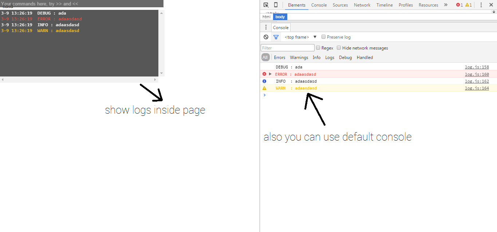

# LogBoxJS
Javascript Logging

## Usage
to add library to your project
```html
  <script src="https://cdn.rawgit.com/nooh64/LogBoxJS/master/build/log.min.js"></script>
```
sample usages
```js
  log.d("your messgae"); // print debug message
  log.d("tag name","your messgae"); // print debug message
  
  log.i("your messgae"); // print info message
  log.i("tag name","your messgae"); // print info message
  
  log.w("your messgae"); // print warn message
  log.w("tag name","your messgae"); // print warn message
  
  log.e("your messgae"); // print debug message
  log.e("tag name","your messgae"); // print debug message
  
  
  log.exclude("tag name1","tag name2"...); // after this line, logs with tags specified will not work
  log.include("tag name","tag name2"...);  // after this line, only shows logs with tags specified
  
  log.show(); // show custom console, within your website
  
  log.showTime(); // show time in logs
  log.hideTime(); // hide time in logs
  
```
 sample
 